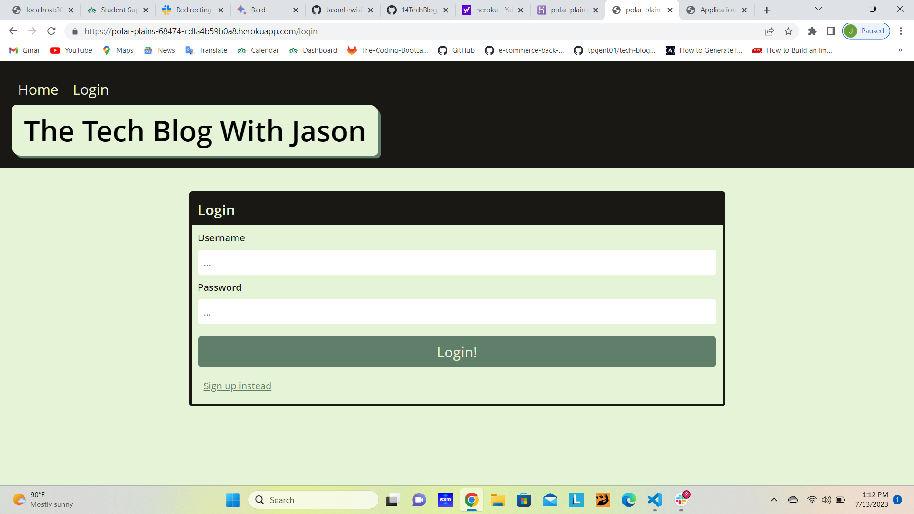

# 14 Model-View-Controller (MVC): Tech Blog

## Description
This app is a blog site that allows users to create an account, login, create posts, comment on posts, and logout.  The app uses the MVC paradigm and is deployed to Heroku.  The app uses the express-handlebars package to implement Handlebars.js for the Views, the MySQL2 and Sequelize packages to connect to a MySQL database for the Models, and an Express.js API for the Controllers.  The app also uses the dotenv package to use environment variables, the bcrypt package to hash passwords, and the express-session and connect-session-sequelize packages to add authentication.  The express-session package stores the session data on the client in a cookie.  When the user is idle on the site for more than a set time, the cookie will expire and the user will be required to log in again to start a new session.  The app is deployed to Heroku and uses JawsDB for the database. 

## Table of Contents
  1. [installation](#installation)
  2. [usage](#usage)
  3. [contribution](#contribution)
  4. [test](#test)
  5. [github](#github)
  6. [email](#email)
  7. [license](#license)
## Installation
npm install 
## Usage
source db/schema.sql, npm start      
## Contribution
1
## Test 

## GitHub: 
jasonlewis007
## Email: 
jason@gmail.com

## License


```


